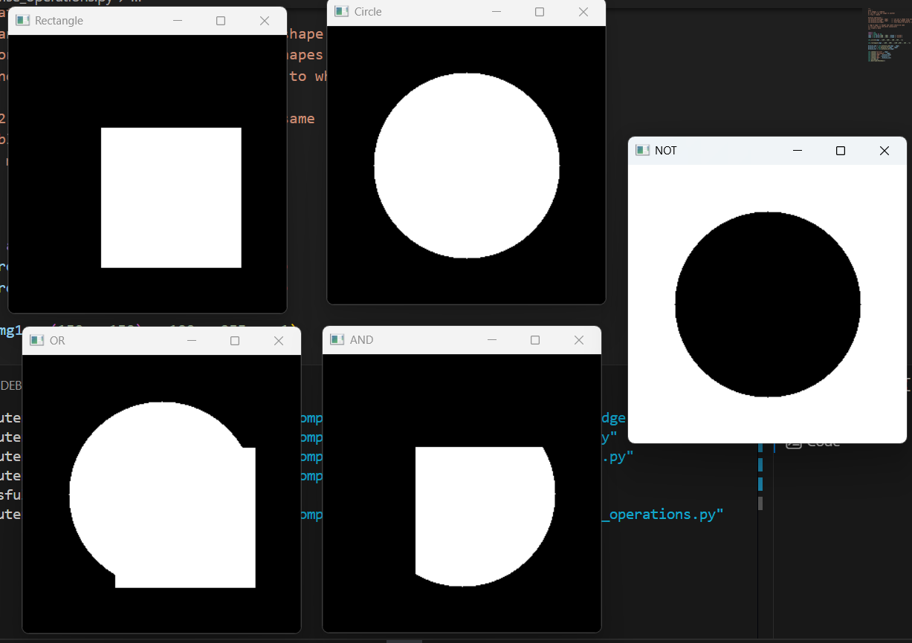
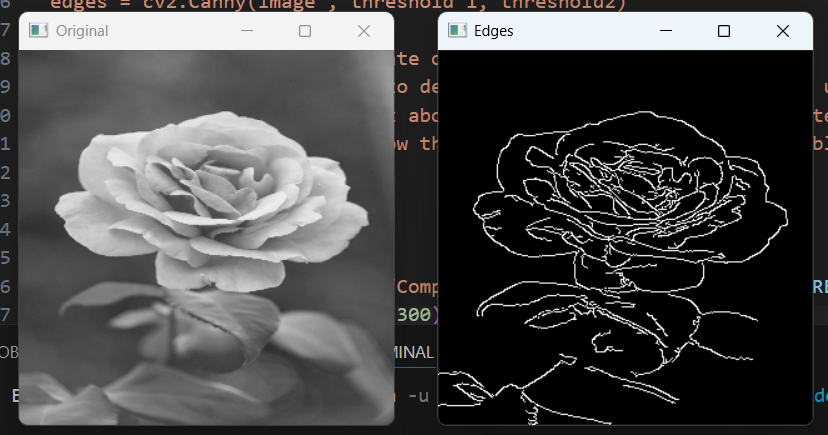
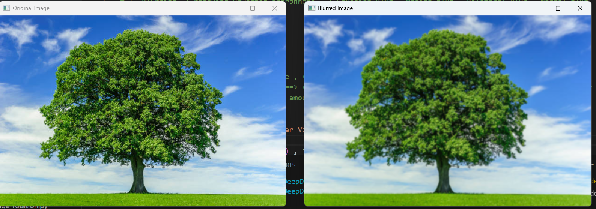
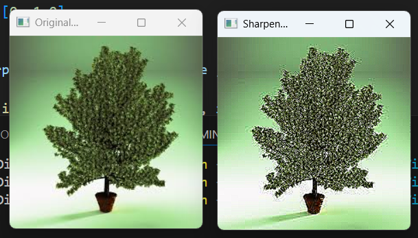

## Basics_OpenCV

A beginner-friendly repository demonstrating fundamental Computer Vision and Image Processing techniques using Python and OpenCV.
This project contains simple examples covering image manipulation, filtering, drawing, edge detection, and basic object detection concepts.

## Topics Covered

- Image Loading and Display
- Image Resizing
- Drawing Shapes and Text
- Image Filtering
- Edge Detection
- Contour and Shape Detection
- Face Detection
- Video Processing

## Requirements

- Python 3.x
- OpenCV

### Install OpenCV using:

pip install opencv-python

## Technologies Used

- Python
- OpenCV
- NumPy

## Screenshots

